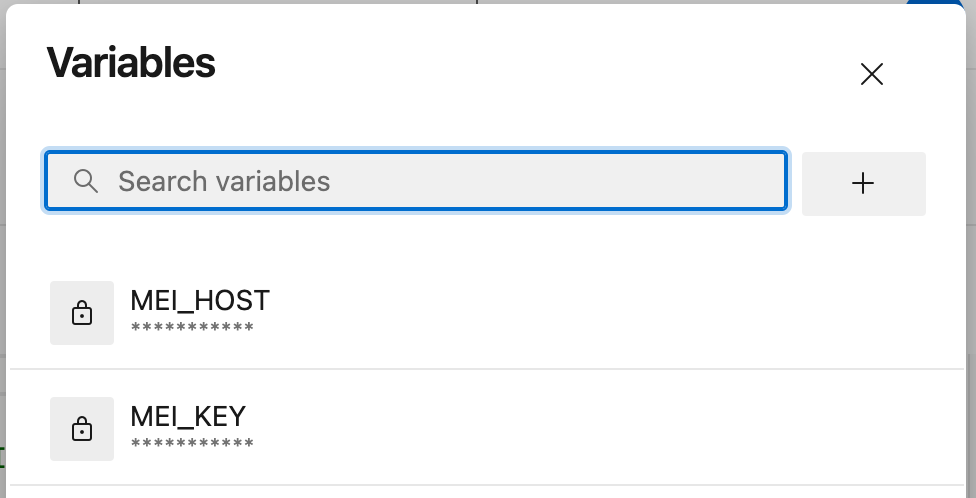

# asure devops ci/cdでsphinx文章を自動でビルドしてサーバにデプロイする方法

## webサーバに環境を構築する

- webサーバをインストールする（例：nginx）
- sphinx文章をビルドするための環境を入れる（例:Pandoc、docs-scraper）
- azureのself-hosted agentをインストールする

例えばmacOSなら以下を参考にインストールする。

[セルフホステッド macOS エージェント](https://learn.microsoft.com/ja-jp/azure/devops/pipelines/agents/osx-agent?view=azure-devops)

## piplines.ymlを作成する

- python　を使うテンプレートなどを流用する
- script.shを実行するようにする
- azureで変数を設定して次に作る　.sh に渡すようにしても良い

この例では、MEI_HOSTとMEI_KEYという変数を作成している



また、エージェントがビルドを実行するディレクトリ　Agent.BuildDirectory　も渡している
```
- script: |
    /bin/bash ./script.sh $(Agent.BuildDirectory) $(MEI_HOST) $(MEI_KEY)
  displayName: 'run script'
```

## script.shを作成する

処理内容を書く。

例えば、
- 仮想環境を有効化して依存をインストールする
- 文書をビルドする
- niginxのディレクトリに結果をコピーしてnginxを再起動
- docs-scraperのディレクトリに移動してスクレイピング実行

## azure devops の リポジトリに push
（設定によるが、）変更があるたびに自動でビルドしてくれる。
